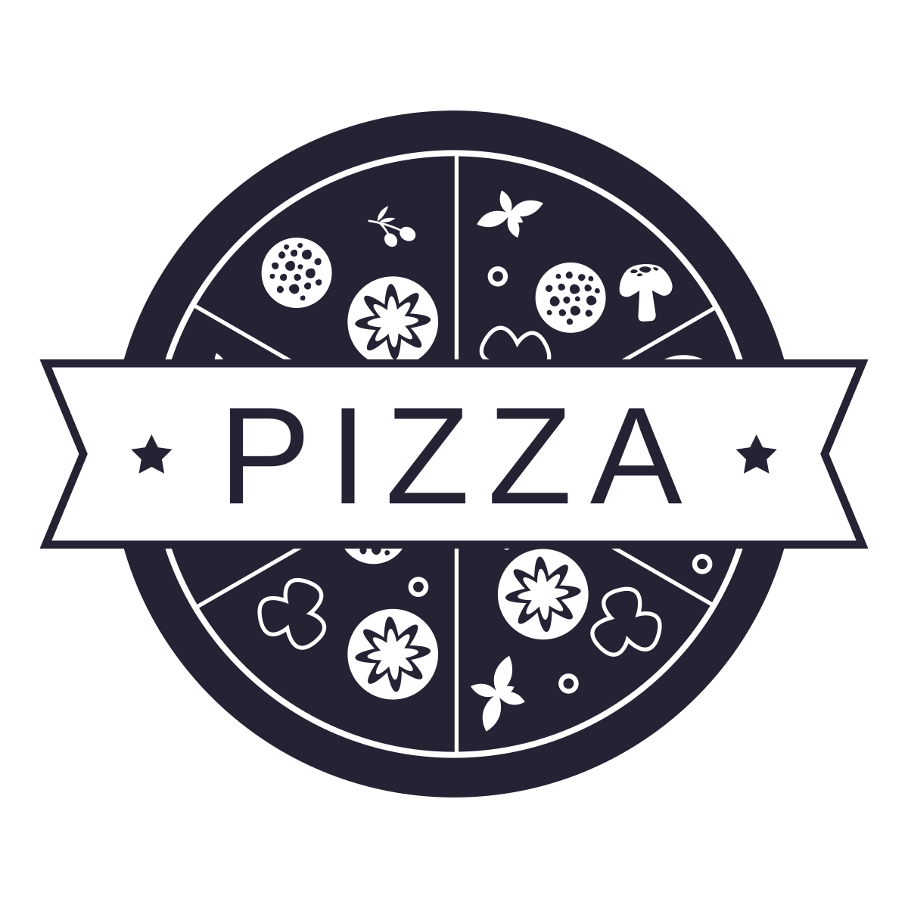

<div align="center">
  
  <h1>🍕 Pizza Cart</h1>
  <em>Pizza Cart Application in React.</em><br/>
  <h4><a href="https://pizza-cart.netlify.app/" target="_blank">« Check Demo »</a></h4>
</div>

## 🧨 Getting Started

Follow the below steps to get the project working.

1. Install the dependencies:

   ```sh
   # Using NPM
   npm install

   # Using Yarn
   yarn
   ```

2. Run using:

   ```sh
   # Using NPM
   npm start

   # Using Yarn
   yarn start
   ```

## ⚡ Features List

1. Listing all pizzas from this [endpoint](https://run.mocky.io/v3/ec196a02-aaf4-4c91-8f54-21e72f241b68)
2. SPA design
3. Dynamic Cart checkout

## 🗃 Tech Stack

<div align="center">
  <table>
    <thead>
      <td><strong>Technology</strong></td>
      <td><strong>Purpose</strong></td>
    </thead>
    <tbody>
      <tr>
        <td>React JS</td>
        <td>Frontend</td>
      </tr>
      <tr>
        <td>Redux</td>
        <td>State Management</td>
      </tr>
      <tr>
        <td>Styled Components</td>
        <td>UI Components</td>
      </tr>
    </tbody>
  </table>
</div>
